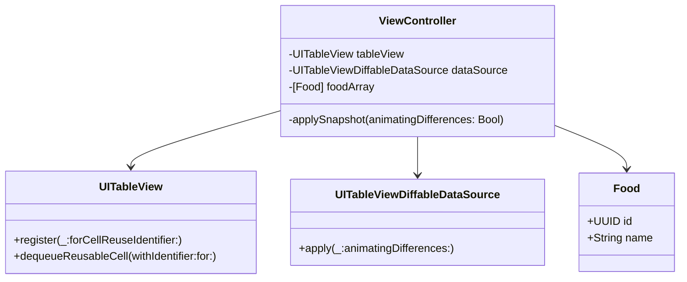

# UITableViewDiffableDataSourceのサンプルアプリ

##　基本構造



## データ更新時のステップ

1. データの変更:
    - データソースの配列（`foodArray`）に対して、追加、削除、または更新の操作を行います。

2. スナップショットの作成:
    - `NSDiffableDataSourceSnapshot`を作成し、セクションとアイテムを追加します。

3. スナップショットの適用:
    - `UITableViewDiffableDataSource`の`apply(snapshot:animatingDifferences:)`メソッドを呼び出し、スナップショットを適用します。

```swift
private func applySnapshot(animatingDifferences: Bool = true) {
    var snapshot = NSDiffableDataSourceSnapshot<Section, Food>()
    snapshot.appendSections([.main])
    snapshot.appendItems(foodArray)
    dataSource.apply(snapshot, animatingDifferences: animatingDifferences)
}
```

## IDが同一だとクラッシュ

`UITableViewDiffableDataSource`では、各アイテムの識別子（ID）が一意である必要があります。同じIDを持つアイテムが複数ある状態でdataSourceにapplyすると以下のようなエラーが発生します。
データの配列に同一IDのものが含まれない設計が必要です。

```
Terminating app due to uncaught exception 'NSInternalInconsistencyException', reason: 'Fatal: supplied item identifiers are not unique. Duplicate identifiers: {(
    <UUID>
)}'
```

### 参考

- [DiffableDataSourceを具体的にわかりやすく解説してみた - Qiita](https://qiita.com/startaiyo/items/61cdad04b53b1a740a90)
- [UITableViewDiffableDataSourceを使用しよう - Galapagos Tech Blog](https://techblog.glpgs.com/entry/2023/03/01/165521)
